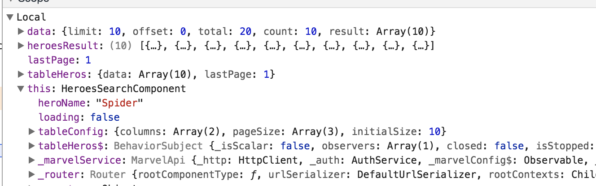

# Last annotations

This is the last step. If we compare the application that we currently have and the application that was in step 0 we will see that there are very few similarities between both. This version is based on modules, each functionality is separated into different files, its performance is better, its processes have a clear flow and is documented. Despite that, there are still some things to explain. 

There are some good practices that I did not apply because they are so extensive that a workshop dedicated to each of them would be necessary to learn how to put them into practice, there are other good practices that I followed from step 0 but I did not comment on it and there are good practices that can only be applied to the latest version of Angular (today is version five), so I decided to treat them at the end. For each of these good practices, I would like to write a paragraph.
 
## Good practices which I have not apply

### Automated test

As an automated test, I am referring to unit tests, integration tests, and end-to-end tests. In all my professional experience I have heard many excuses not to write tests on a project; for example: we do not have time, these hours can't be sold to the client, they are too difficult to implement, etc. There are many valid arguments in all existing technologies to counteract these excuses but as we are talking about Angular I will only deal with the specific case of Angular.

As we saw in the previous steps, there are two typical modules in Angular; the central module and the sharing module. Both modules have the mission to inject classes that are used extensively throughout the application. This is good because it means that we can concentrate a large part of the logic on a single point so that we can develop faster. However, it has a disadvantage; an error in one of these classes can have strong consequences in various parts of the application. In other words; more reusability means easier mistakes. Automatic tests are the best way to ensure that changes do not have unexpected results since the main mission of the test is to ensure that the functionality of each part of the application remains the same. So, if you do not want all the time and money saved using Angular in the development phase to be lost in the maintenance phase, do not forget to code tests.

You can information about how to code automated test for angular in the next links:
* [Official documentation](https://angular.io/guide/testing)
* [Angular testing guide](https://medium.com/google-developer-experts/angular-2-testing-guide-a485b6cb1ef0)

### Error treatment

Please, do not take as an example how to deal with errors in this application. This is far from being a good way to resolve an exception in Angular:
```
(err: any) => { throw new Error(err);
```
The first thing is that you should never throw an uncontrolled exception. It is bad no matter what technology you are coding. It is true that an uncontrolled exception doesn't have many consequences in a web application. The browser will not fall for this, but, as you should know, Angular applications can be executed in more places than a browser. For example, if we want to have SEO with Angular, we must use Universal, which makes the same front-end code run on the server side. An uncontrolled exception on the server is the best way to make your application crash for all users.

The second is that an error message in the console is the worst way to inform the user that something bad has happened. In general, some actions must be performed here, such as a navigation to an error web page or to open a modal window with a message. Certainly, the way to deal with errors and the exception is really broad and depends on the particular requirements of the application. It is for this reason that I decided not to make another "step" about this issue. However, there are several articles you can take as a basis for correct error handling. For example:

* [Custom Exception Handler](https://netbasal.com/angular-2-custom-exception-handler-1bcbc45c3230)
* [Error Handling & Angulat](https://medium.com/@aleixsuau/error-handling-angular-859d529fa53a)

## Good practices which I applied but I didn't comment

### Lint

Lint is a tool that helps you keep the code style consistent for all developers. It is like a "compiler" that points out the places in your code that do not have a good style according to some rules that can be configured. However, lint is more than making sure all your lines are bled in the same column. Lint helps you prevent mistakes that can have more serious consequences. For example, lint notifies you when you have an unused import. An unused import means that you are linking a library that makes your bundles bigger for no reason, so it will have a direct impact on the performance of your application. Lint also warns you when you forget the semicolon at the end of a line. JavaScript does not need a semicolon to mark the end of a statement, but if you are going to use uglify in your code to make smaller bundles, the semicolon is the only mark that can be used by browser's JavaScript compiler to separate one statement from another. So make sure you have tslint in your development dependencies and your code editor / IDE is configured to use it.

### Path tree

I've already commented that, in my opinion, it is not advisable to have a more than one level of folders under "app" directory. It makes difficult to find the source files and it makes the relative paths of the imports more sensible at the changes. The rule here is to have one folder by module and name it in the same way. For example, the details folder contains the details module. After that, if you want to do an extra classification, you can use the file name. The majority of the developers add the word "component", "service", "module" or "router" between the name of the file and the extension to mark the files related to a component, service, module or the paths of the router respectively. For example: "details.module.ts" is the definition of the details module and "details.router.ts" is the list of routes inside the module.

### Named the variables

There is a convention that says that the private elements in JavaScript should start by "_" and the ones which are observables should end with "$". Last week a had a debate in my office because a friend of mine thinks that this convention became useless in Angular because TypeScript already marks the elements of a class as private and public. The same for observables, in TypeScript there is types definition which show us what kind of value contains a variable. At this argument I would add that, if you are using the living documentation and you have the right configuration in your code editor/ IDE, that information also appears at the same time you are writing the code. However, my friend, as well as everyone who think in that way have forgotten that which is running in the browser is not TypeScript or the living documentation comments; it is JavaScript and JavaScript does not know anything about private, public or types. Let see an example:

This screenshot shows the variables of the search component that you can see in Chrome if you are debugging the app and you are not following the variables name convention:


As you can see it is hard to distinguish which variable is public and which one is private. It is also hard to see if any of them involves an asynchronous behavior because we can not distinguish the observables. Maybe if we follow the convention...


And this is the reason because, despite the type definition of TypeScript and the classification about public and private, we should follow this name convention

## Good practices that can be applied in Angular 5 and next versions

### Pipe method in Observables

In previous versions of Angular we were using the RxJS operator in that way:
``` 
import 'rxjs/add/operator/map';

(...)
let varAsync = Observable.create(observer=>{(...)});
(...)

varAsync.map(data => {(...)});
```
This way of using the RxJS operators has two inconveniences. The first inconvenient is that the observable object does not have the map method by default. When doing this import, we are adding this map method in the Observable prototype, which means that, if we pass the "varAsync" as input to another component, it will be possible to use the map method without making any import. As a result, a dependency is created between the two components. If the import of the map in the first component is deleted, a breaking change will be created that will affect all the components that received the "varAsyc".
The other inconvenience is that this way of importing is ignored by lint. If we stop using the map method in the code, nothing will warn us that we are importing something that we are not using and that has a direct impact on the performance of our application. 

Angular 5 includes RxJS 5.5 which has a new method called pipe:
```
import { map } from 'rxjs/operators'

(...)
let varAsync = Observable.create(observer=>{(...)});
(...)

varAsync.pipe(map(data => {(...)}));
```
This method can be used to pipe differents operators without modifying the prototype of observable. It also allows us to import operators in a more conventional way which can be tracked by lint

You can read more about pipe in the next articles:
* [Rxjs Understanding Lettable Operators](https://blog.angularindepth.com/rxjs-understanding-lettable-operators-fe74dda186d3)
* [Rxjs 5.5 piping all the things](https://blog.hackages.io/rxjs-5-5-piping-all-the-things-9d469d1b3f44)

And, of course, you can have a look at the last modification in the example.

### Compilation AoT in develop

As you probably know, Angular has two run modes JiT and AoT. The big difference between them is that, with AoT, there is a compilation of the Angular code when the bundles are built. It improves the performance of the application because:

1. The browser does not have to compile the code at runtime. This task is already done
2. The angular compiler code can be removed from the packages, which makes our production files smaller.

However, there is a great disadvantage. Not all the code that works in JiT can work in AoT and, when we are developing, we are running our application in JiT mode. That means that, sometimes, the code that we are moving to production fails in the construction phase and finding the problem is often difficult. For that reason, it is really advisable to perform a local production build before making a change.

**Note:**
In fact, there is a bug in the template of the search component that I would not find if I had not compiled in AoT


Now, from version 5 of Angular, it is possible to execute the code in AoT mode in development. You simply add the "--prod" flag to the "ng serve" command in your package.json:
```
"start:aot": "ng serve --prod --proxy-config proxy.conf.json",
```

You can find more information about how to make your code compatible with AoT in the next articles:
* [AoT Compiler](https://angular.io/guide/aot-compiler)
* [How to create an AoT/JiT compatible angular 4 library](https://medium.com/@trekhleb/how-to-create-aot-jit-compatible-angular-4-library-with-external-scss-html-templates-9da6e68dac6e)
* [writing an AoT-friendly application](https://medium.com/spektrakel-blog/angular-writing-aot-friendly-applications-7b64c8afbe3f)

### Remove the white spaces in the templates

In the Angular 5 version, it is possible to configure the compilation of the code to remove the white spaces from the html templates. To do it just add the next lines in the tsconfig.json file: 
```
"angularCompilerOptions": {
    "preserveWhitespaces": false
  }
```

The benefit of this configuration is smaller bundles to better performs loading the app in the browser. You can read more about the "preserveWhitespaces" option in the [offical documentation of Angular about the components](https://angular.io/api/core/Component#preserveWhitespaces) and [about the compiler options](https://angular.io/guide/aot-compiler#preservewhitespaces)

## How to run the example

This example uses the public Marvel API as a backend data source. To use it you need to have a Marvel public and private key. To get them is easy; go to [the developers portal](https://developer.marvel.com/), create an account and copy your key from your [account information page](https://developer.marvel.com/account). After that, look for in the code where the keys are needed:
```
marvelPublicKey: '<Your public key from marvel account>',
marvelPrivateKey: '<Your private key from marvel account>'
```
And replace the strings "<Your public key from marvel account>" and "<Your private key from marvel account>" for your public and private key respectively.

**Important: do not push in the Github repository your private key**

## Authors:

### Adrian Ferreres:
Angular developer since beta 17 and technical speaker. He has worked in several IT consulting projects in Spain with the framework and, currently works as frontend developer for Censhare in Munich

### Ruben Aguilera:
Regular technical speaker, Angular and Polymer expert, developer trainers and advanced software architect. Ruben had worked on many projects, as a full stack developer. Currently working in Spain for Autentia and wrote all his lessons learned in the book ["Angular: guía práctica"(only in Spanish... sorry)](https://leanpub.com/angular-guia-practica)

### Alfredo de la Calle:
Angular, React, Polymer, native javascript ..... all-terrain developer. Alfredo has worked in startups and some project of IT consultancies.  Currently, he works at GFT consulting as a front-end developer.

### Oleksandr Fedotov:
Full-stack developer, with a special passion for front-end development. Big fan of Javascript and functional programming. At the moment working as an IT Consultant at Netlight in Munich.
